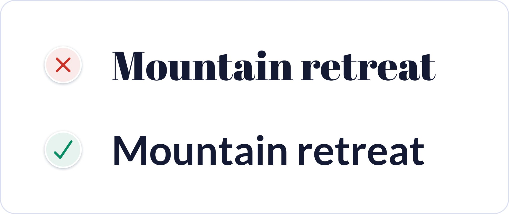
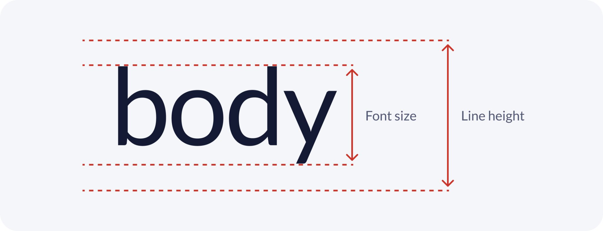

UI 设计并没有那么复杂。在我两年的产品设计师生涯中，我意识到大部分视觉和交互设计的都遵守几个简单的逻辑规则。不是艺术天赋或直觉，只是几个简单的规则。

最快速的学习就是实践，所以让我们开始吧。

## 使用逻辑规则修复此示例

以下是一个短期业务租贷应用程序的物业详情页。第一个是原版，第二个是根据我的规则改进的版本。

即使你没有太多视觉交互设计的经验，你可能也会觉得原版设计感觉很凌乱。这是因为它在设计上有很多细节问题，可用性很差。可能你已经发现了一些问题。

我会依次使用以下规则或者说准则一次性修复原版的问题：

<ol>
  <li><a href="#_1-使用间距对相关元素进行分组">使用间距对相关元素进行分组</a></li>
  <li><a href="#_2-保持一致性">保持一致性</a></li>
  <li><a href="#_3-确保外观相似的元素功能相似">确保外观相似的元素功能相似</a></li>
  <li><a href="#_4-创建清晰的视觉层次结构">创建清晰的视觉层次结构</a></li>
  <li><a href="#_5-删除不必要的样式">删除不必要的样式</a></li>
  <li><a href="#_6-有目的地使用颜色">有目的地使用颜色</a></li>
  <li><a href="#_7-确保界面元素具有-3-1-的对比度">确保界面元素具有 3:1 的对比度</a></li>
  <li><a href="#_8-确保文本具有-4-5-1-的对比度">确保文本具有 4.5:1 的对比度</a></li>
  <li><a href="#_9-不要仅仅依靠颜色作为指标">不要仅仅依靠颜色作为指标</a></li>
  <li><a href="#_10-使用单一的无衬线字体">使用单一的无衬线字体</a></li>
  <li><a href="#_11-使用带有较高小写字母的字体">使用带有较高小写字母的字体</a></li>
  <li><a href="#_12-尽量不使用大写字母">尽量不使用大写字母</a></li>
  <li><a href="#_13-只使用常规和粗体字体粗细">只使用常规和粗体字体粗细</a></li>
  <li><a href="#_14-避免纯黑色文字">避免纯黑色文字</a></li>
  <li><a href="#_15-左对齐文本">左对齐文本</a></li>
  <li><a href="#_16-对正文文本使用至少-1-5-倍行高">对正文文本使用至少 1.5 倍行高</a></li>
</ol>

## 1. 使用间距对相关元素进行分组

将信息分解为更小的相关元素组有助于构建更清晰的页面结构。这使人们更快、更容易理解和记忆。

使用合理的间距对相关元素进行分组就是一种非常有效且简单的方法。你还可以组合多种分组方法，以便更清晰的显示分组结构。

在我们的示例中，原版内容之间缺乏间隙，所以看起来杂乱无章。增加间距有助于让内容的分组更加清晰。

## 2. 保持一致性

在 UI 设计中保持一致性非常重要。一致性意味着相似的元素在外观和功能上都表现得相似。

在我们的示例中，图标样式不一致，因为有些样式已填充，有些则未填充。我们统一使用线性圆角绘制图标。

并且在每个图标下添加文字描述，帮助人们理解它的作用。

## 3. 确保外观相似的元素功能相似

如果元素看起来很相似，人们会期望它们以类似的方式工作。因此，请尽量确保对具有相同功能的元素使用一致的视觉处理。

在我们的示例中，图标容器和 "Book now" 按钮有相似的视觉样式。这会让它们看起都是交互式的，即使它们不是。从图标中删除蓝色和按钮样式有助于避免它们被误认为是交互式元素。

## 4. 创建清晰的视觉层次结构

让界面中重要的元素看起来更突出，根据重要程度展示信息。

可以使用大小、颜色、对比度、间距、位置和深度的变化来创建清晰的视觉层次结构。

下面是一个没有明确视觉层次结构的网站横幅的示例，然后是按重要性顺序清晰呈现元素的横幅。

如果想要测试你的视觉层次结构是否清晰，一种快速简便的方法是使用斜视测试。只需眯起眼睛，看看你的设计。或者，可以远离屏幕或模糊你的设计。你仍然应该能够分辨出最重要的元素是什么，并识别界面的用途。

让我们将斜视测试应用于我们的示例。我们可以看到，有多个同样突出的元素在争夺注意力。同时，左下角的主要动作一点也不突出。

主要操作通常应该是界面上最突出的元素。为其提供高对比度的背景颜色和粗体字体粗细来提高该元素的层次。

使用斜视测检查试我们的设计，可以看到主要操作明显是右下角的 "Book now" 按钮。

## 5. 删除不必要的样式

不必要的视觉风格可能会分散注意力，并可能增加认知负担（浪费大脑内存）。

尽量避免不必要的线条、颜色、背景和动画，以创建更简单、更集中的界面。

在我们的示例中，图像周围的空白和边框增加了不必要的视觉复杂性。它们不需要传达信息或对元素进行分组，因此可以删除它们以简化设计。

## 6. 有目的地使用颜色

谨慎使用颜色，有目的地使用。尽量避免纯粹使用颜色进行装饰，因为它可能会造成混淆和分散注意力。普通内容尽量使用黑白色，只在传达意义的地方添加颜色。

一种简单有效的方法是将品牌颜色应用于文本链接和按钮等交互式元素。这有助于教人们什么是互动的，什么是非互动的。尽量避免在非互动元素上使用品牌颜色。

不需要为所有交互式元素添加颜色，因为有些元素已经有视觉提示表明它们是交互式的。例如，以下示例中的卡片仍然具有交互性，无论是否带有蓝色链接。

在我们的原始示例中，蓝色标题可能看起来不错，但它使文本看起来具有交互性。为了避免混淆，可以从标题中删除蓝色，因为它不是交互式的。

我们还从其他非交互式元素（如星级）中删除了蓝色。这样可以更容易地看到哪些是交互式的，哪些是非交互式的。

## 7. 确保界面元素具有 3:1 的对比度

对比度是衡量两种颜色之间感知亮度差异的量度。它表示为 1：1 到 21：1 的比例。例如，黑色背景上的黑色文本具有最低的 1：1 对比度，而白色背景上的黑色文本具有最高的 21：1 对比度。有许多[在线工具](https://usecontrast.com/)可以帮助您测量不同颜色之间的对比度。

为了帮助确保有视力障碍的人能够清楚地看到界面细节，力争至少满足 [Web 内容可访问性指南 （WCAG）](https://www.w3.org/TR/WCAG21/) 2.1 AA 级颜色对比度要求。这意味着用户界面元素（如表单字段和按钮）至少需要具有 3：1 的对比度。

在我们的示例中，箭头图标对比度太低。为图标添加阴影并在图像的顶部三分之一处添加渐变叠加，无论图标位于哪个图像上，都可以提供足够的 3：1 对比度。

原始示例中的主按钮对比度也太低。我们之前在处理视觉层次结构时修复了它，但这里也值得一提。

低对比度按钮的风险在于，视力低下的人可能无法将其识别为按钮，因为他们看不到按钮的形状。将按钮对比度提高到 3：1 以上可使按钮可访问，还有助于纠正视觉层次结构。

将箭头和按钮的对比度增加到 3:1 以上的比例，可得到以下设计。我们正在一点一点地完善我们的设计，但我们仍然有很多的问题需要解决。

## 8. 确保文本具有 4.5:1 的对比度

为了帮助确保视力障碍者能够清晰地阅读文本，它需要满足以下 WCAG 2.1 AA 级对比度要求：

- 小文本（18 像素及以下）需要至少 4.5:1 的对比度。
- 大文本（粗体粗细高于 18 像素或常规粗细高于 24 像素）需要至少 3:1 的对比度。

在我们的示例中，照片计数元素中的小文本对比度不足。我们通过增加灰色容器的不透明度并添加文本阴影，将对比度提高到 4.5:1 以上。

描述文本的对比度也太低。薄的字体重量使其更难阅读。使用较深的灰色阴影有助于使文本更易于访问。我们将对文本进行进一步更新以改进它。

## 9. 不要仅仅依靠颜色作为指标

色盲有许多不同的类型，它们主要影响男性。通常，色盲的人很难区分红色和绿色，但有些人根本看不到任何颜色。

为了确保色盲人员可以访问界面，您不能仅依靠颜色来传达含义或区分视觉元素。您需要使用其他视觉提示来区分界面元素。

在我们的示例中，“评论” 文本上使用蓝色来表示它是一个链接。如果删除颜色，则链接文本看起来与其他文本相同，因此色盲无法判断它是链接。在没有颜色的情况下，为链接文本添加下划线可以清楚地将其与其他文本区分开来。

## 10. 使用单一的无衬线字体

字体是一组具有相似风格或审美的相关字体。Helvetica 是字体的一个例子。字体是字体中的变体，例如粗细或大小。例如，Helvetica 粗体和 Helvetica regular 是 Helvetica 字体中的 2 种不同字体。

使用单一的无衬线字体（也称为"无装饰"或"无细节"字体）进行界面设计是最安全的，因为它们通常是最清晰、中性和最简单的。

在我们的示例中，标题使用了详细的衬线字体，这有点难以阅读，可能会分散某些人的注意力。它还具有可能与此物业租赁应用程序中的某些照片不匹配的个性。使用无衬线字体简化它有助于提高可用性和美观性。

## 11. 使用带有较高小写字母的字体

寻找具有较高小写字母和较大字母间距的字体，因为它们通常在小尺寸下更清晰。字体中小写字母的高度称为 x height。

我们的示例使用 Gill Sans 字体，该字体的 x height 相对较低。将字体更改为具有较大 x height 的字体（如 Lato），有助于提高可读性。

下面是字体从 Gill Sans 更新到 Lato 后的示例。

## 12. 尽量不使用大写字母

除非你对人大喊大叫，否则没有太多正当理由使用大写字母。声音很大，难以阅读。

当你阅读时，你看的是一个单词的形状，而不是看每个字母。形状可帮助您更快地识别单词。大写单词都具有相同的矩形形状。这迫使您一个接一个地阅读每个字母。

在我们的示例中，位置文本使用大写。将其更改为句子大小写，其中只有第一个单词和专有名词（人名、地点或事物的名称）大写，有助于提高可读性。

## 13. 只使用常规和粗体字体粗细

仅仅因为字体中有很多字体粗细可用，并不意味着您需要在设计中使用所有这些字体粗细。使用许多不同的字体粗细会给界面增加噪音和混乱。这也使得一致地使用每种字体粗细变得更加困难。

仅使用常规和粗体字体粗细，使您的设计系统保持简单明了。

快速使用提示：

- 对标题使用粗体粗细来强调它们。
- 对其他较小的文本使用常规字体粗细。
- 如果您决定使用非常细或较粗的字体粗细，请将它们保留用于标题和较大的文本，因为它们可能难以以较小的尺寸阅读。

在我们的示例中，位置文本使用浅色字体粗细。尽管我们已将对比度提高到所需的 4.5：1 对比度以上，但某些人仍然难以阅读细字符。将字体粗细增加到常规字体有助于提高可读性并简化设计。

## 14. 避免纯黑色文字

对于 UI 设计，通常最安全的是避免纯黑色，因为它与白色的对比度非常高。这种高对比度会导致阅读文本时眼睛疲劳和疲劳。

黑色的色彩亮度为 0%，白色的色彩亮度为 100%。颜色亮度的巨大差异使我们的眼睛更加努力地工作。最安全的做法是避免纯黑色与白色，而是选择深灰色。

在我们的示例中，纯黑色用于多个元素。将其更改为深灰色有助于提高可读性。以前在查看视觉层次结构时，我们注意到属性描述文本过于突出。为了确保界面元素按重要性顺序显示，我们在属性描述文本中使用较浅的灰色来降低其突出性。

## 15. 左对齐文本

英语从左到右，以F形模式向下阅读。因此，最好保持文本左对齐以获得最佳可读性。对于长正文文本，最安全的做法是避免居中对齐或对齐的文本。阅读起来更加困难，尤其是对于那些有认知障碍的人来说。

居中对齐可以用于标题和短文本，因为它可以快速阅读。但是，居中对齐会使较长的正文文本更难阅读，因为每行的起点都在不断变化。你的眼睛需要更加努力地找到每条线的起点。

在我们的示例中，属性描述文本居中对齐。左对齐文本可提高可读性，并且也与上面左对齐的文本一致。

## 16. 对正文文本使用至少 1.5 倍行高

行高是两行文本之间的垂直距离。行与行之间的间距有助于防止人们重读同一行文本。阅读起来看起来和感觉也更舒适。

为了提高可访问性和可读性，尤其是对于长正文文本，请确保行高至少为 1.5 （150%）。将线高保持在 1.5 到 2 之间通常效果很好。

在我们的示例中，行高仅为 1 （100%）。将其增加到 1.6 （160%） 有助于提高可读性。

## 我们修好了！

通过一些简单但功能强大的 UI 设计指南，我们很快发现并修复了示例设计中的一大堆问题。

我希望你开始看到UI设计不必那么难。它可能看起来是一种神奇的艺术形式，但其中很多都是由逻辑规则或准则组成的，就像我们刚刚学到的那样。使用客观逻辑而不是主观意见，可以更快、更轻松地设计直观、可访问且美观的界面。

## 更多内容

这些只是我的 [UI 设计书](https://www.practical-ui.com/)中的一些逻辑驱动的指南。你会在书中找到数百个详细的例子。

## 参考链接

- [www.adhamdannaway.com/category/blog/ui-design](https://www.adhamdannaway.com/category/blog/ui-design)